## Planet data time series evolution for
(30.544509178, 76.61544614)

6-10-2020
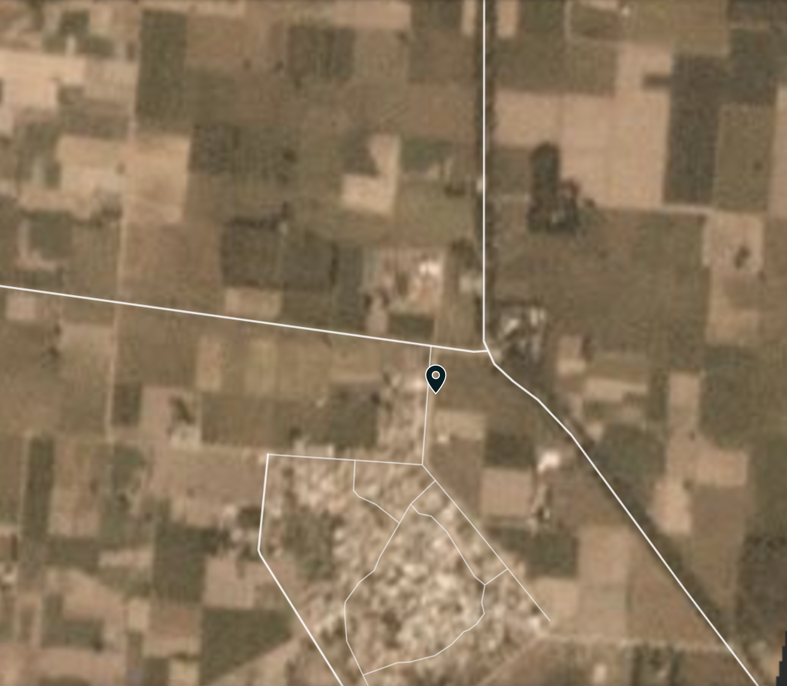
10-10-2020
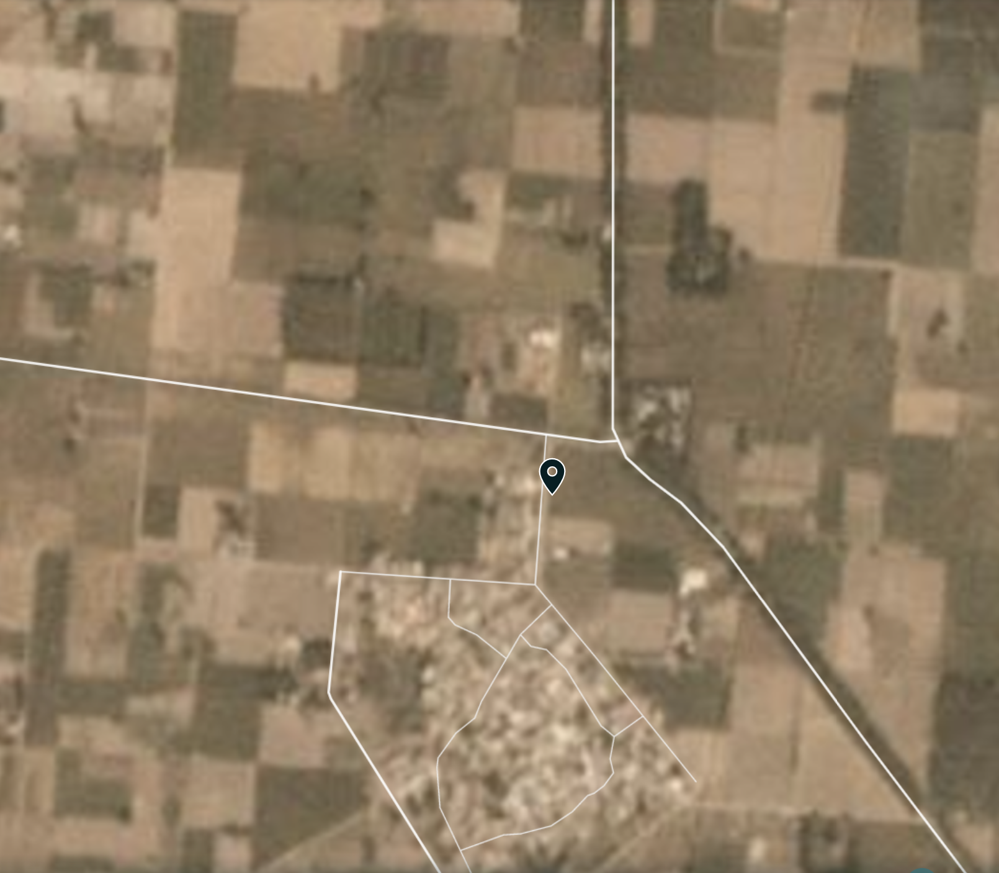
11-10-2020
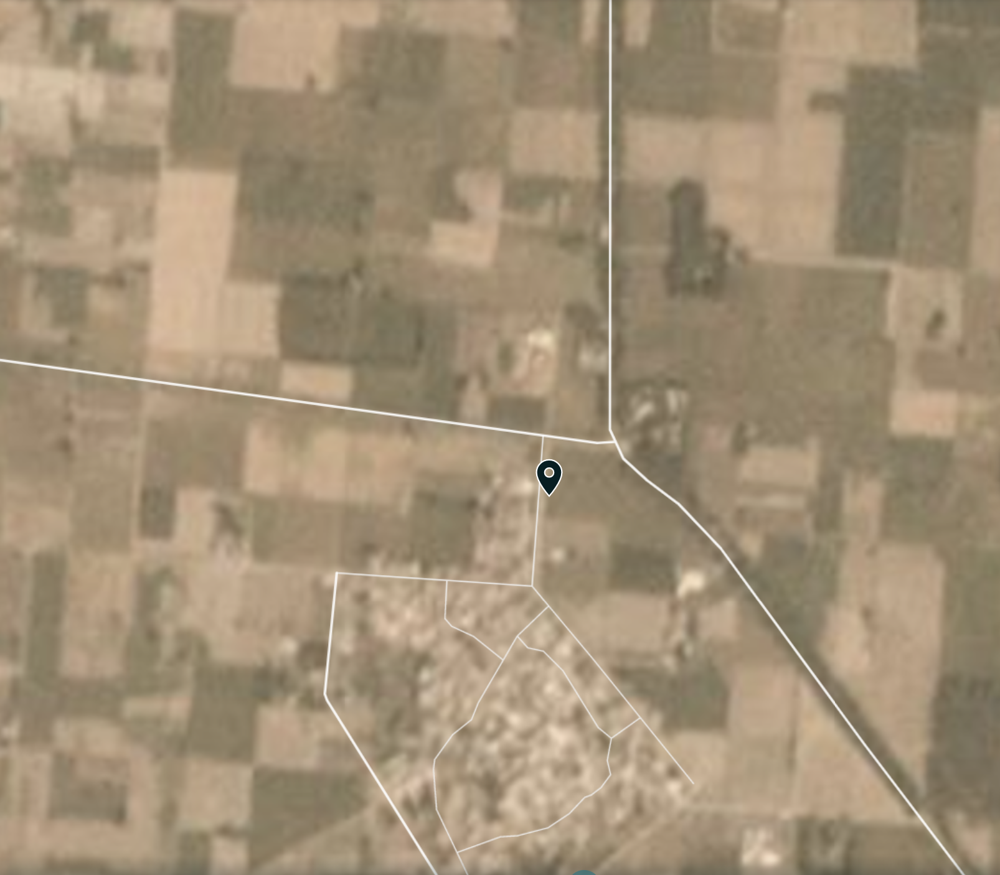
12-10-2020
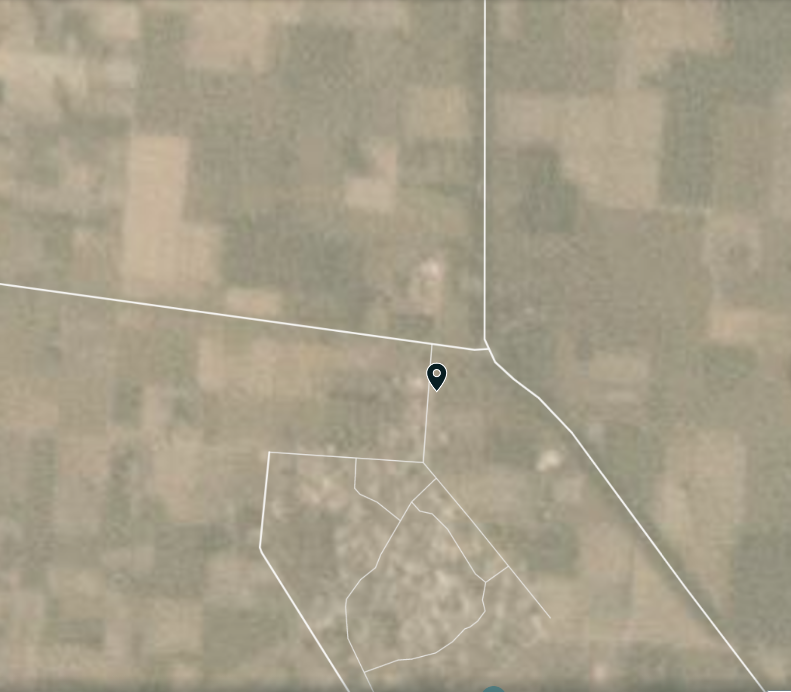
13-10-2020
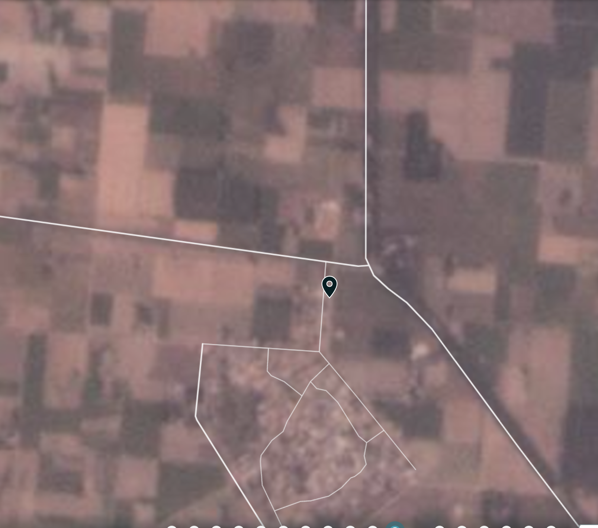
17-10-2020
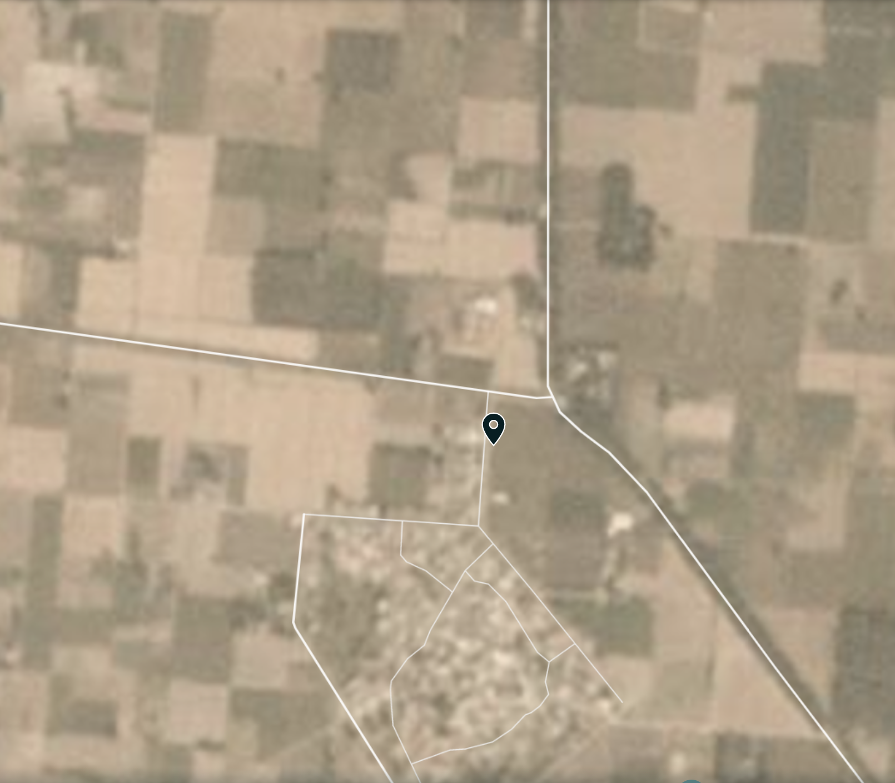
18-10-2020
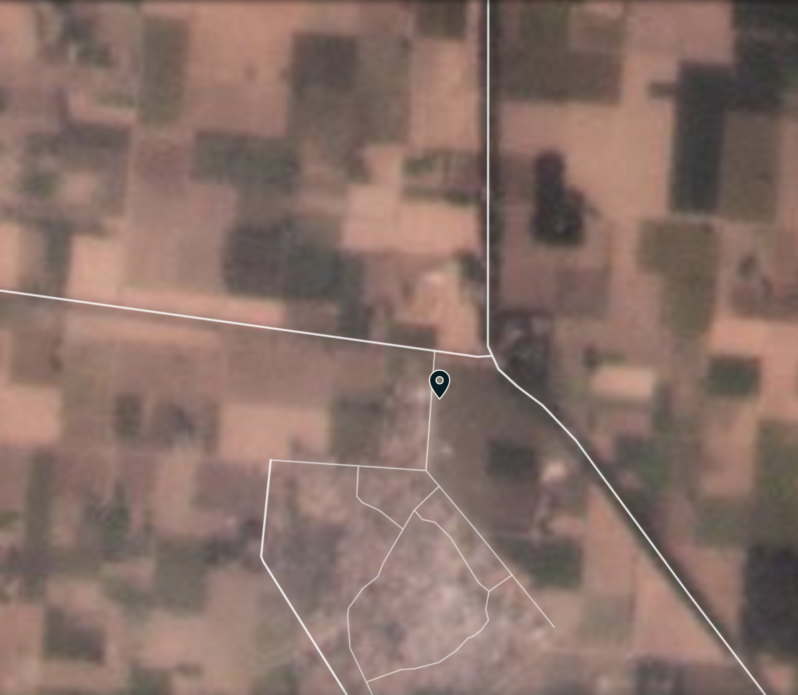
19-10-2020
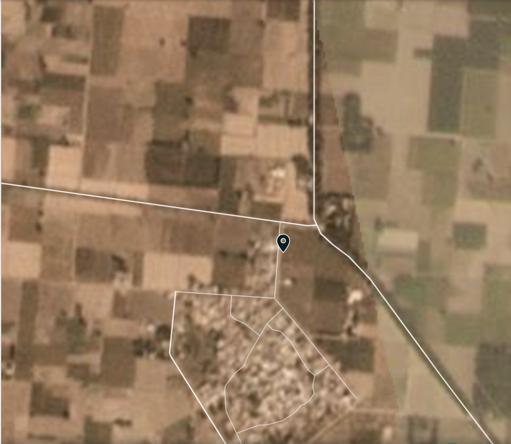
20-10-2020
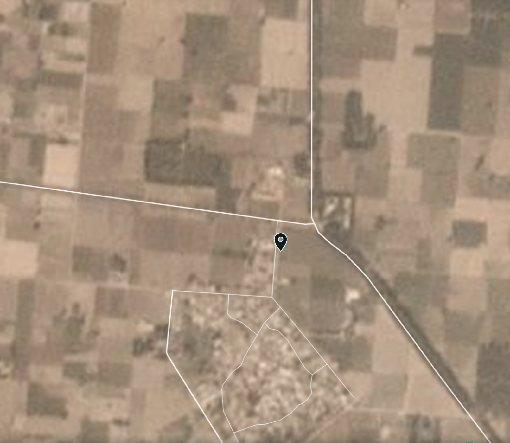
21-10-2020
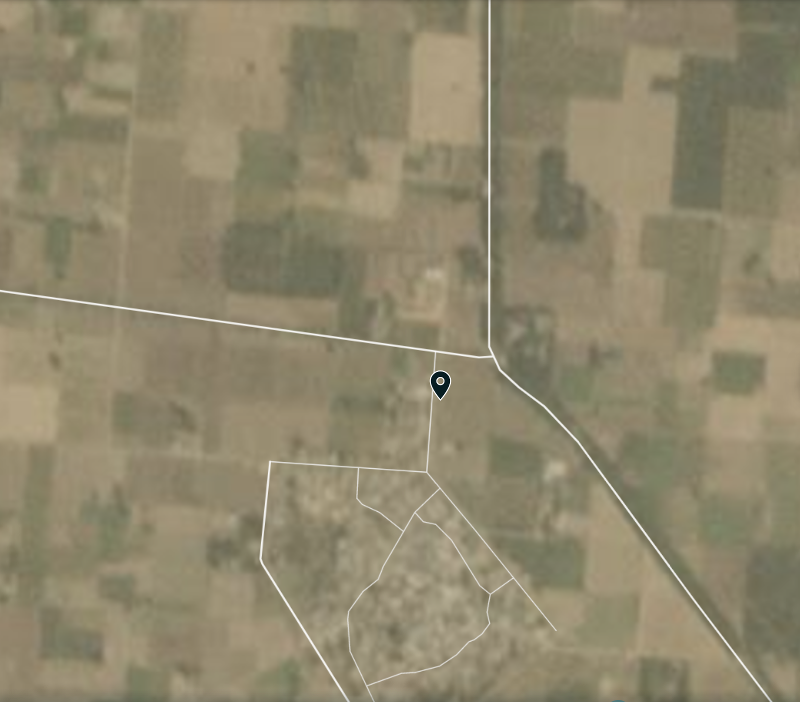
22-10-2020
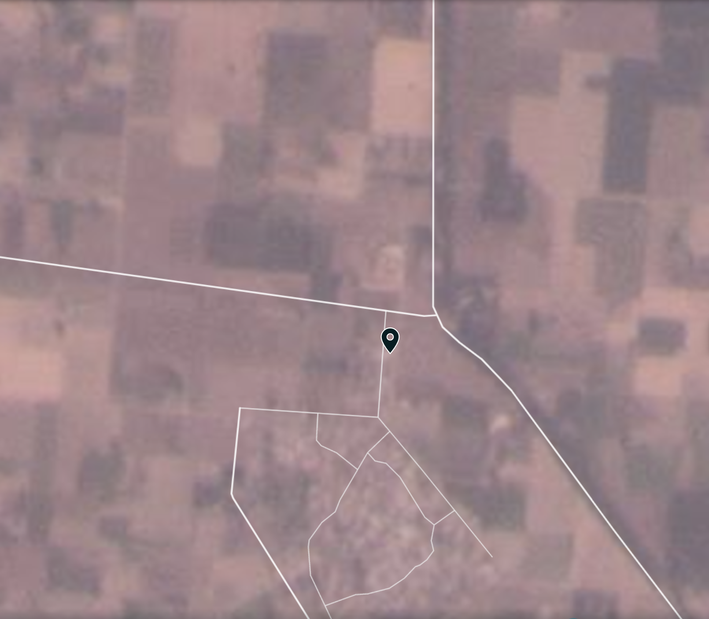

## NASA FIRE
Does NASA fire detection API gets something during the month of October?

